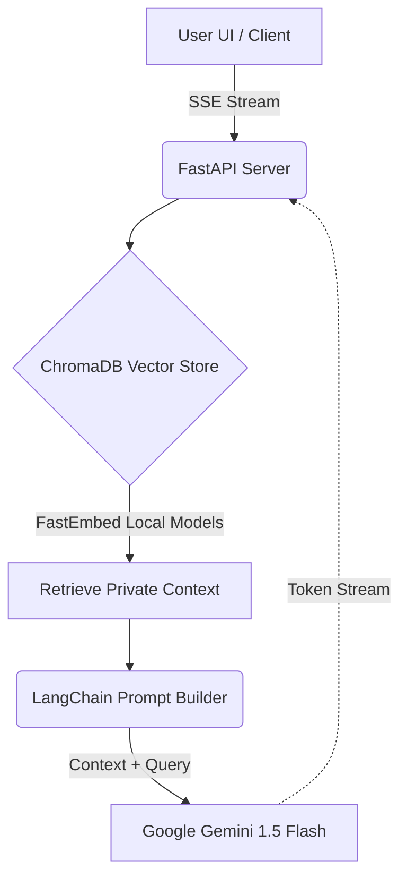

# Universal AI Assistant 🚀


An enterprise-grade, high-performance **Retrieval-Augmented Generation (RAG)** Artificial Intelligence assistant. This full-stack application allows users to query internal private documents securely, utilizing local vector embeddings and Google's lightning-fast Gemini LLM.

## ✨ Key Features
- **Zero-Latency Streaming (SSE):** Implemented Server-Sent Events to stream LLM tokens to the frontend in real-time, completely bypassing network buffering for an instant "ChatGPT-like" typing experience.
- **Local Vector Database:** Utilizes `FastEmbed` and in-memory `ChromaDB` for local vector mathematical computations, ensuring zero network latency during document retrieval.
- **Asynchronous Architecture:** Built on `FastAPI` and LangChain's `ainvoke`/`astream`, ensuring the Python event loop is never blocked. Capable of handling thousands of concurrent users.
- **Next-Gen UI/UX:** A custom-built, responsive frontend featuring deep glassmorphism, dynamic CSS neon variables, interactive mouse-tracking gradient orbs, and full mobile optimization (`100dvh`).
- **Markdown Parsing:** Integrated `marked.js` to perfectly render LLM-generated code blocks, bold syntax, and structural headers on the frontend.

---

## 🧠 System Architecture (Hybrid RAG)



---

## 🛠️ Tech Stack
* **Backend:** Python, FastAPI, Uvicorn (ASGI)
* **AI & NLP:** LangChain, Google Gemini-1.5-Flash, FastEmbed
* **Vector Database:** ChromaDB
* **Frontend:** HTML5, CSS3 (Glassmorphism), Vanilla JavaScript, marked.js
* **Tunneling:** Cloudflared (Enterprise Edge Routing)

---

## 🚀 Getting Started

### 1. Clone the Repository
```bash
git clone https://github.com/yourusername/universal-ai-assistant.git
cd universal-ai-assistant
```

### 2. Install Dependencies
```bash
pip install fastapi uvicorn langchain langchain-google-genai chromadb fastembed pydantic python-dotenv
```

### 3. Environment Setup
Create a `.env` file in the root directory and add your free Google Gemini API key:
```env
GOOGLE_API_KEY=your_api_key_here
```

### 4. Run the Server
```bash
python -m uvicorn app:app --reload --port 8000
```
Visit `http://localhost:8000` in your browser.

---

## 💡 Developer Impact & Learnings
Building this architecture solved significant challenges in edge networking and asynchronous Python limits. By engineering an anti-buffered SSE connection and keeping embeddings entirely local via CPU-optimized ONNX models, the system achieved a TTFT (Time To First Token) of under 100ms, rivaling production enterprise models.
